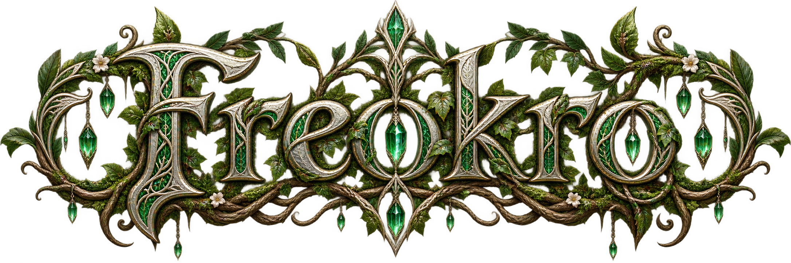
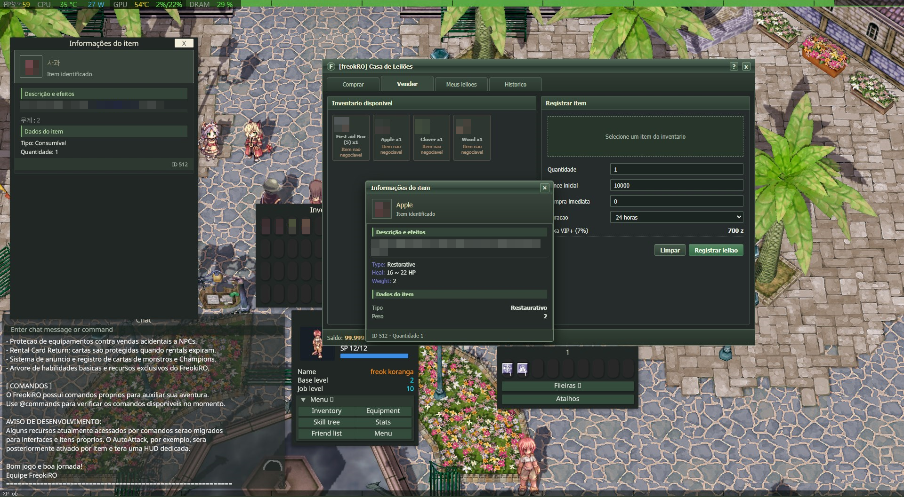
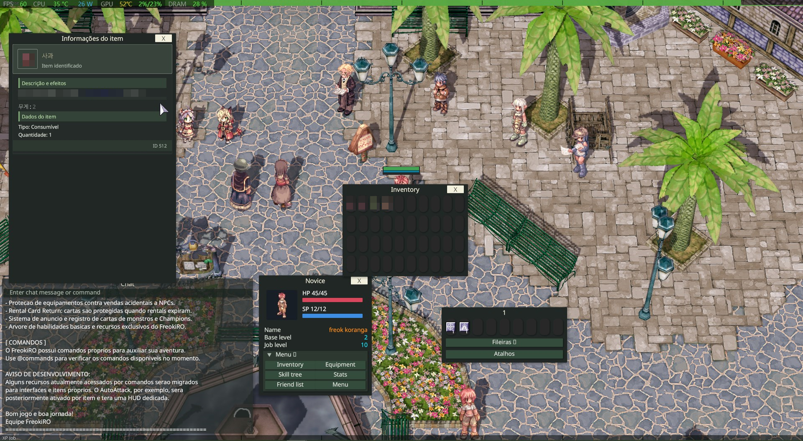

<p align="center">
  
</p>

# 🌿 FreokRO

[](https://opensource.org/licenses/MIT)

FreokRO is a custom game project with its own visual identity. Its client adapts [Korangar](https://github.com/vE5li/korangar), a Rust Ragnarok Online client with real-time lighting and a customizable interface. Upstream Korangar supports Linux, Windows, and macOS; the FreokRO build and local installation documented here were validated on Windows.

The emblem above is the project's visual direction. The first terrain pilot applies four project-supplied ground textures to Prontera and removes its static scenery at load time. See the [map migration baseline](reports/baseline.md) and [validation status](reports/validation.md) for the current scope and remaining checks.

## 🧩 FreokRO adaptation

`freokro` is the active FreokRO development branch. The `dev` branch preserves the earlier client line based on [upstream Korangar](https://github.com/vE5li/korangar) tag [`v0.1.1-20260220`](https://github.com/vE5li/korangar/releases/tag/v0.1.1-20260220); `rebase` integrates that line with newer upstream `main`. Neither upstream nor fork `main` is modified by this work. The client requires the [FreokRO rAthena fork](https://github.com/piabapiaba801/freokro-rathena-korangar), configured for protocol `20220406` without packet obfuscation. The original Ragexe line uses `PACKETVER 20250716` and runs separately.

The [FreokRO Auction HUD](https://github.com/piabapiaba801/freokro-auction-hud) is a separate process in a **private** repository. The base game does not require it; the **Black Market** interface does. The server handles **Black Market (7007)** and opens the local HUD bridge when the skill is used in town. This client implements the regular item and equipment windows. Check protocol, skill, and auction changes across all three projects.

### 📥 Downloads and Windows requirements

| Purpose | Official dependencies |
| --- | --- |
| Play with prebuilt binaries | Install [MariaDB Server](https://mariadb.org/download/) and the [Visual C++ Redistributable v14 x64](https://learn.microsoft.com/en-us/cpp/windows/latest-supported-vc-redist?view=msvc-170) for the [FreokRO server](https://github.com/piabapiaba801/freokro-rathena-korangar). Prepare compatible game assets from your own installation. |
| Build this client | Install [Rustup](https://rustup.rs/) (`rust-toolchain.toml` selects `nightly-2026-02-01`), [Git for Windows](https://git-scm.com/install/windows), [Slang `slangc`](https://github.com/shader-slang/slang/releases) **2025.18.2 or newer**, and [NASM](https://www.nasm.us/) in `PATH`. The [LunarG Vulkan SDK](https://vulkan.lunarg.com/sdk/home) is another source for `slangc`. Rust may also request the [Visual Studio MSVC prerequisites](https://rust-lang.github.io/rustup/installation/windows-msvc.html). |
| Use the auction | In addition to the server and client, install the [private HUD](https://github.com/piabapiaba801/freokro-auction-hud), [.NET Desktop Runtime 8 x64](https://dotnet.microsoft.com/en-us/download/dotnet/8.0), and the [WebView2 Evergreen Runtime](https://developer.microsoft.com/en-us/microsoft-edge/webview2/). |

`slangc` is needed **to compile shaders**, as specified by `korangar/build.rs`; it is not required separately to start an already-built executable. This repository does not distribute `data-freokro.7z` or other game assets.

### 🏗️ Build

The reference build on Windows is:

```powershell
cargo +nightly-2026-02-01 build --release --locked -p korangar --features unicode,debug
```

Upstream Korangar's build requirements also apply. Game assets, `data-freokro.7z`, local server configuration, and the deployed executable stay outside this source repository.

### ▶️ Run and validate

The in-game menu includes **Skin**. **Classic** is the first choice and the default; **Original** keeps the previous theme. Classic applies the auction's dark green palette to controls and windows using the in-game theme, with a separate adjustment to item descriptions. Item descriptions preserve Ragnarok color codes, render separator lines, and show equipped card icons when their sprites load. The choice is saved in `client/interface_settings.ron` when the client exits.

Prepare assets in the installation directory, start the database and servers before the client, and run the HUD agent to use the auction. The local **FreokRO Client (iniciar tudo)** shortcut performs that sequence but is not part of this repository. Auction window opening was confirmed. After the October 7, 2026 database schema fix, the user confirmed escrow passed in the client; bidding, buying, cancellation, and item return need separate checks. Compilation alone does not validate every feature.

### ⚡ Startup performance

Normal startup skips the full content hash of the game archives. `sync-cache` still calculates it, and debug builds can opt into verification by setting `KORANGAR_VERIFY_GAME_FILES=1` before launch. This keeps the existing cache sync hash while avoiding a full read of the multi-gigabyte archive on every ordinary launch.

In one controlled local Windows comparison on October 8, 2026, direct Vulkan launches reached a responsive window in **11.1 seconds** with the prior executable and **7.9 seconds** with the optimized build, using the same game directory. The hash phase fell from **2,961 ms** to **0 ms**. The regular DX12 launcher was observed at **15.6 seconds** before this change; the updated executable reached a responsive DX12 window in **12.6 seconds** in a separate test. These are single-run measurements and can vary with launch conditions and disk cache state. Opening `data-freokro.7z` still took about **4–5 seconds**.

See [TECHNICAL_STATUS_FREOKRO.md](TECHNICAL_STATUS_FREOKRO.md) for the current FreokRO state. The earlier client checkpoint remains in [TECHNICAL_STATUS_DEV.md](TECHNICAL_STATUS_DEV.md).

### 📸 FreokRO client captures

These October 7, 2026 captures show the locally running client. The auction is supplied by the separate private HUD. The client and auction item windows are visibly different here, so these images are a reference for the ongoing Classic skin work. Item description text and item sprites are mosaicked in both captures.



*Black Market, inventory, and item descriptions open together.*



*The client item description and inventory with the auction closed.*

## Upstream Korangar reference

The screenshots, installation pages, community links, and package overview below come from the upstream project. They may not reflect this FreokRO build or the Classic skin.

##### Upstream Korangar screenshots (not a validation of the FreokRO Classic skin)

*Geffen in the afternoon*


*Geffen at night*

## 🚀 Running

> [!IMPORTANT]
> Korangar is still very early in development and is anything but feature-complete.

If you want to try it out for yourself, check out the [Installation page](wiki/Installation.md).

## 🔧 Troubleshooting

If you're running into issues while setting up or running Korangar please check the [Troubleshooting page](wiki/Troubleshooting.md). In case your issue is not listed feel free to [create an issue](https://github.com/vE5li/korangar/issues/new) or use the dedicated `support` channel on our [Discord server](https://discord.gg/2CqRZsvKja).

## 🤝 Contributing

This is a very ambitious project and we are always looking for contributors. If you are interested, please read [this page](wiki/Contributing.md).

## 🔥 Updates

There is a dedicated channel for `updates` on our [Discord server](https://discord.gg/2CqRZsvKja). If you want to stay up to date with development or see recent changes, go check it out!

## 📦 Packages

We try to keep the project as modular as possible by splitting the codebase into individual crates. All the crates prefixed with `ragnarok-` are **independent of Korangar and have no dependencies on it**.

We encourage everyone to use these crates for their own Ragnarok Online related projects and contribute back if they want to.
